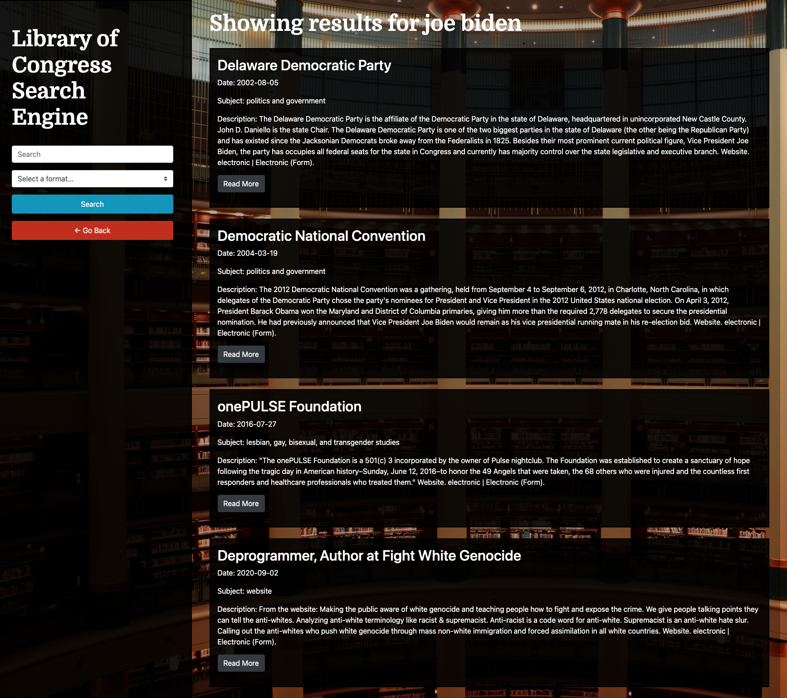

# Library of Congress Search Tool

### Description

A web application that searches and displays results from the Library of Congress API. As a user you can either perform a generic search for data in all formats or select a format in the form to help filter results. When on the results page the user may make additional searches and new data will be displayed. 


## [Site](https://josiemald.github.io/library-congress-SE/)

## [Repository](https://github.com/JosieMald/library-congress-SE)

### Homepage


### Results Page



### Project

```
Used in this project: Bootstrap, Google fonts, jQuery, 

* Bootstrap: Design and responsiveness

* jQuery: Functionality to dynamically display query results and fetch data.


```